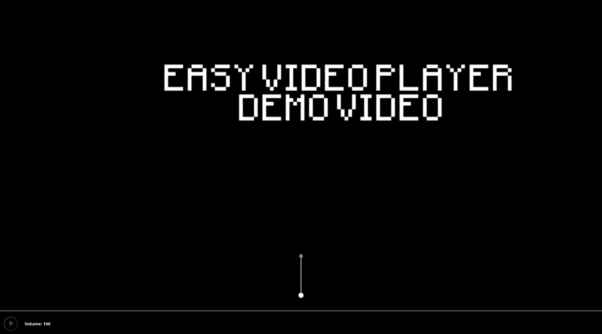

# Easy Video Player

The easiest video player ever made.

(Made for Hack Club Crescent)

## Description

Easy Video Player is a fully working video player where every control is deliberately miserable to use. It was made for Hack Club Crescent's Bad UI card, where the rule is that a bad interface still has to work: you can play, pause, seek and change the volume, you'll just hate every second of it.

Upload any video and try out the controls:

* **Volume:** open the volume popup and you get 10 seconds to click a button, however many times you click in that time is your volume. If you want 37%? Click exactly 37 times, want to mute it? just sit there and do nothing for 10 seconds.
* **Seek bar:** a ball hangs from a rope under a slider. Drag the slider to move it (the rope swings a lot), then click to drop the ball. Wherever it lands on the timeline is where the video will jump to.

### Screenshots



## Getting Started

### Dependencies

* A modern desktop browser (Only tested in Firefox)
* A video file to play

### Installing

* There's nothing to install if you use the live demo: https://easyvideoplayer.tomttfb.com
* To run it locally, clone the repository:

```
git clone https://github.com/tomTTFB/easyvideoplayer.git
```

### Executing program

* Open the live demo (https://easyvideoplayer.tomttfb.com), or run a local server in the project folder:

```
python -m http.server
```

* Go to `http://localhost:8000` in your browser
* Choose a video on the upload screen

## Help

* **The video won't load:** try an MP4 file. Some formats (like MKV) won't play in every browser.
* **It doesn't really work on a phone:** it was built for desktop and I haven't properly tested it on mobile. I think the UI is off the screen, I might fix it at some point

## License

MIT